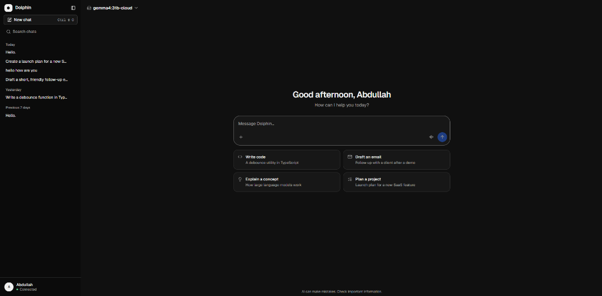
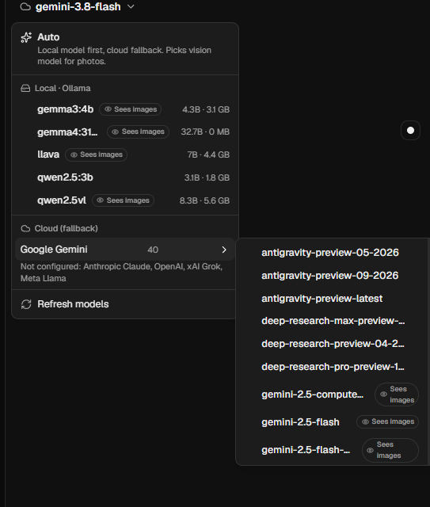
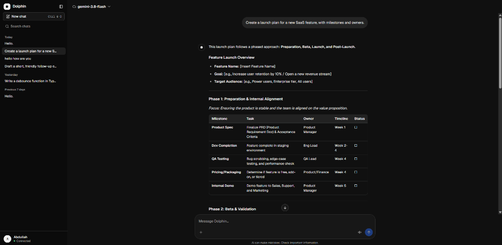
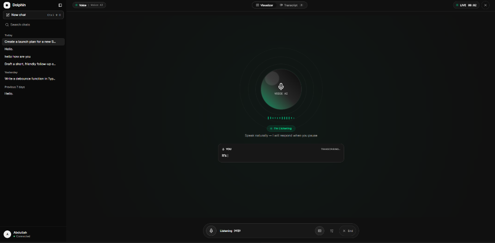
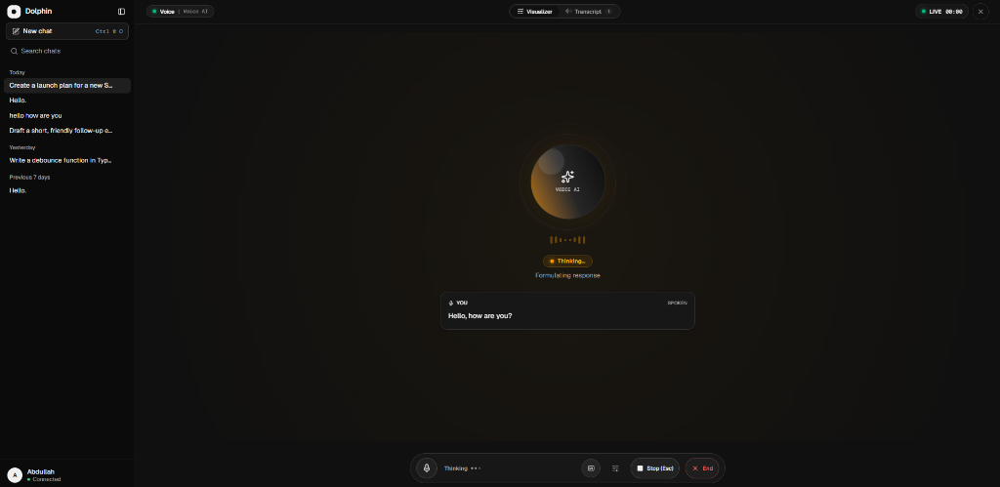

# 🐬 Dolphin AI — Next-Gen Multi-Modal AI Assistant

> **A production-ready, privacy-first AI assistant powered by local Ollama models with seamless cloud AI fallbacks, real-time WebRTC voice mode, multi-modal vision, and document processing.**

[](https://github.com/AbdullahAhmed922/Dolphin)

---

## ✨ Features & Previews

### 🏠 1. Local-First & Privacy-Focused

Prioritises local Ollama models (`qwen2.5:3b`, `llama3.2`, `gemma3`) and managed cloud models (`gemma4:31b:cloud`) — your data never leaves your machine unless you choose cloud fallback.

<p align="center">
  
</p>

---

### ⚡ 2. Dynamic Model Selection & Cloud Fallbacks

Switch seamlessly between local Ollama models and 5 cloud providers (Anthropic, OpenAI, Google Gemini, Grok, Meta Llama) directly from the in-app model picker — no restart required.

<p align="center">
  
</p>

---

### 📊 3. Rich Markdown, Data Tables & Document Processing

Native rendering for code blocks with syntax highlighting, formatted data tables, structured project plans, and uploaded document attachments (PDF, code files, plain text).

<p align="center">
  
</p>

---

### 📷 4. Multi-Modal Vision

Attach photos via camera, paste, or drag-and-drop. Vision-capable models (`gemma3`, `qwen2.5vl`, `llava`, and cloud equivalents) automatically analyse the images in context.

---

### 🎙️ 5. Real-Time WebRTC Voice Conversations

Powered by LiveKit for low-latency speech-to-text (AssemblyAI), intelligent turn detection, adaptive interruption handling, and expressive text-to-speech (Fish Audio). Includes noise cancellation via ai-coustics.

<p align="center">
  
</p>

<p align="center">
  
</p>

---

## 🤖 Supported Models

| Category | Model | Description |
| :--- | :--- | :--- |
| **Managed Cloud** | `gemma4:31b:cloud` | Google Gemma 4 31B via Ollama Cloud |
| **Local Ollama** | `qwen2.5:3b`, `llama3.2`, `gemma3:4b` | Offline models running locally |
| **Vision & Photos** | `gemma3`, `qwen2.5vl`, `llava`, `llama4` | Multi-modal image analysis |
| **Voice Agent (Integrated)** | Via API (`app` mode) | Uses the same backend as chat — supports local + cloud |
| **Voice Agent (SonicAi)** | `google/gemma-4-31b-it` | Standalone LiveKit agent |
| **Cloud — Anthropic** | Claude 3.5 / Claude 4 | Automatic fallback |
| **Cloud — OpenAI** | GPT-4o / GPT-4.1 / GPT-5 | Automatic fallback |
| **Cloud — Google** | Gemini 2.5 Flash / Pro | Automatic fallback |
| **Cloud — Grok** | Grok-4 / Grok-5 | Automatic fallback |
| **Cloud — Meta** | Llama-4 | Automatic fallback |

Cloud fallback priority is configurable via `CLOUD_PRIORITY` in `.env`.

---

## 🛠️ Tech Stack

| Layer | Technologies |
| :--- | :--- |
| **Frontend** | Next.js 16.3, React 19.2, TypeScript 7, Tailwind CSS 4, shadcn/ui, Radix UI, Geist Font |
| **Backend** | Python 3.13, FastAPI, Pydantic v2, Ollama SDK, OpenAI SDK, Anthropic SDK, PyMuPDF |
| **Voice Agent** | LiveKit Agents Framework, AssemblyAI STT, Fish Audio TTS, ai-coustics Noise Cancellation |
| **Tooling** | `uv` (Python), `npm` (Node.js), Ruff (linting/formatting), Pytest |
| **Deployment** | Docker & Docker Compose |

---

## 📂 Project Structure

```
Dolphin/
├── ai-assistant/                  # Main application
│   ├── api/                       # FastAPI backend (port 8000)
│   │   ├── app/
│   │   │   ├── core/              # Config, logging, middleware
│   │   │   ├── providers/         # Ollama, OpenAI-compat, Anthropic
│   │   │   ├── routes/            # /api/chat, /api/models, /api/health, /api/upload
│   │   │   ├── services/          # Chat orchestration
│   │   │   ├── voice/             # LiveKit voice session management
│   │   │   ├── documents.py       # PDF & code file extraction
│   │   │   ├── images.py          # Photo handling
│   │   │   └── vision.py          # Vision model detection
│   │   └── tests/                 # Pytest suite
│   ├── agent/                     # Integrated LiveKit voice agent (Docker)
│   │   ├── voice_agent.py         # LiveKit agent entry point
│   │   ├── app_llm.py             # Routes voice LLM calls through the API
│   │   └── settings.py            # Agent configuration
│   ├── web/                       # Next.js frontend (port 3000)
│   │   ├── components/
│   │   │   ├── chat/              # Composer, messages, model picker, sidebar
│   │   │   ├── voice/             # Voice bar, visualiser, session management
│   │   │   ├── photos/            # Photo gallery, attachment tray, viewer
│   │   │   └── documents/         # Document upload tray
│   │   └── app/                   # Next.js App Router pages
│   └── docker-compose.yml         # Full-stack orchestration
├── SonicAi/                       # Standalone LiveKit voice agent
│   ├── agent.py                   # Agent entry point (gemma-4-31b-it)
│   └── app.py                     # Gradio web UI
└── assets/screenshots/            # README screenshots
```

---

## 🚀 Quick Start

### Prerequisites

- **Node.js** ≥ 20.9
- **Python** ≥ 3.13
- **uv** (Python package manager)
- **Ollama** (optional, for local models)

### Step 1 — Pull Ollama Models (Optional)

```bash
ollama pull qwen2.5:3b
ollama pull llama3.2
ollama pull gemma4:31b:cloud
```

### Step 2 — Start Backend API

```bash
cd ai-assistant/api
cp .env.example .env       # Configure API keys for cloud fallback
uv sync
uv run fastapi dev app/main.py
# → http://localhost:8000
# → http://localhost:8000/docs (Swagger UI)
```

### Step 3 — Start Frontend

```bash
cd ai-assistant/web
cp .env.example .env.local
npm install
npm run dev
# → http://localhost:3000
```

### Step 4 — Start Voice Agent (Optional)

**Option A — Integrated agent** (routes LLM through the backend API):

```bash
cd ai-assistant/agent
cp .env.example .env       # Set LIVEKIT_URL, LIVEKIT_API_KEY, LIVEKIT_API_SECRET
uv sync
uv run python voice_agent.py dev
```

**Option B — SonicAi standalone** (direct LLM via LiveKit Inference):

```bash
cd SonicAi
uv sync
uv run python agent.py dev
```

---

## 🐳 Docker Deployment

### Core Stack (API + Web)

```bash
cd ai-assistant
cp api/.env.example api/.env
docker compose up --build
```

### With Voice Agent

```bash
docker compose --profile voice up --build
```

### With Ollama in Docker

```bash
docker compose --profile ollama up --build
# Then set OLLAMA_HOST=http://ollama:11434 in api/.env
```

---

## ⚙️ Environment Variables

All configuration is done through `.env` files. See [`ai-assistant/api/.env.example`](./ai-assistant/api/.env.example) for the full reference.

| Variable | Purpose |
| :--- | :--- |
| `OLLAMA_ENABLED` / `OLLAMA_HOST` | Enable local Ollama and set its URL |
| `ALLOW_CLOUD_FALLBACK` | Try cloud providers when local models fail |
| `CLOUD_PRIORITY` | Order of cloud provider fallback |
| `ANTHROPIC_API_KEY` | Enable Anthropic (Claude) |
| `OPENAI_API_KEY` | Enable OpenAI (GPT-4o, etc.) |
| `GEMINI_API_KEY` | Enable Google Gemini |
| `GROK_API_KEY` | Enable Grok |
| `META_API_KEY` | Enable Meta Llama |
| `LIVEKIT_URL` / `LIVEKIT_API_KEY` / `LIVEKIT_API_SECRET` | Enable voice mode |
| `MAX_IMAGES_PER_MESSAGE` / `MAX_IMAGE_BYTES` | Photo upload limits |
| `VISION_MODELS` | Extra patterns for vision-capable models |

---

## 🧪 Testing

```bash
cd ai-assistant/api
uv run pytest           # Run the test suite
uv run ruff check .     # Lint
uv run ruff format .    # Format
```

---

## 👤 Author

**Abdullah Ahmed** — [abd1962964@gmail.com](mailto:abd1962964@gmail.com)

---

## 📄 License

Distributed under the **MIT License**.
